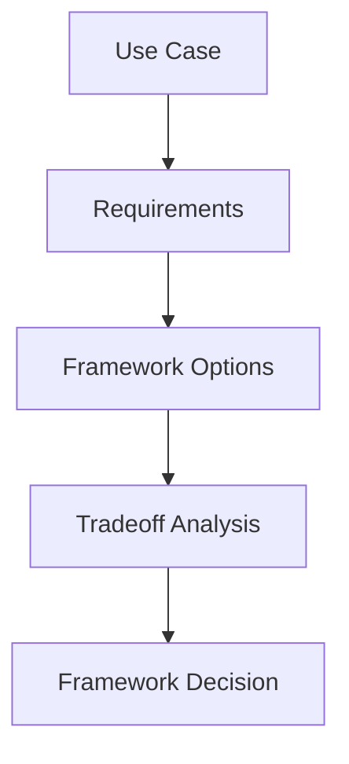

# Module 12 — Agent Frameworks Comparison

[繁體中文](12-agent-frameworks-comparison_zh.md)

## Goal

Learn how to compare agent frameworks and choose the right one for a project.

No framework is best for every use case. The right choice depends on workflow complexity, tool integration, memory needs, multi-agent design, and production requirements.

---

## Mental Model

```text
Use case → Requirements → Framework strengths → Tradeoffs → Decision
```

---

## Comparison Dimensions

### Abstraction Level

How much the framework hides or exposes the agent loop.

### Workflow Control

How well the framework supports state machines, routing, retries, and human approval.

### Tool Integration

How easily tools and MCP servers can be connected.

### Memory Support

How memory can be added, retrieved, audited, and shared.

### Multi-Agent Support

How the framework handles supervisor, specialists, debate, reflection, and handoff.

### Production Readiness

How well the framework supports tracing, evaluation, deployment, and error handling.

---

## Framework Categories

| Category | Best for |
|---|---|
| Lightweight SDKs | Simple agents and direct model control |
| Workflow frameworks | State machines and production workflows |
| Multi-agent frameworks | Role-based collaboration and agent teams |
| RAG frameworks | Knowledge retrieval and document workflows |
| Observability tools | Tracing, evaluation, and monitoring |

---

## Architecture Diagram



---

## Hands-on Exercise

Compare frameworks for a project:

```text
Project goal:
Workflow complexity:
Tool requirements:
Memory requirements:
Multi-agent requirements:
Production requirements:
Recommended framework:
Reasoning:
```

---

## Checklist

You understand this module if you can:

- compare frameworks by system requirements
- avoid choosing tools by hype
- explain tradeoffs
- match framework to project stage
- design framework-agnostic architecture

---

## Common Mistakes

- Choosing a framework before defining requirements
- Using a complex framework for a simple task
- Ignoring production needs
- Locking business logic too deeply into one framework
- Confusing demos with maintainable systems

---

## Outcome

After this module, you should be able to choose agent frameworks based on engineering needs rather than popularity.

You have completed the Agent Engineering Curriculum.
