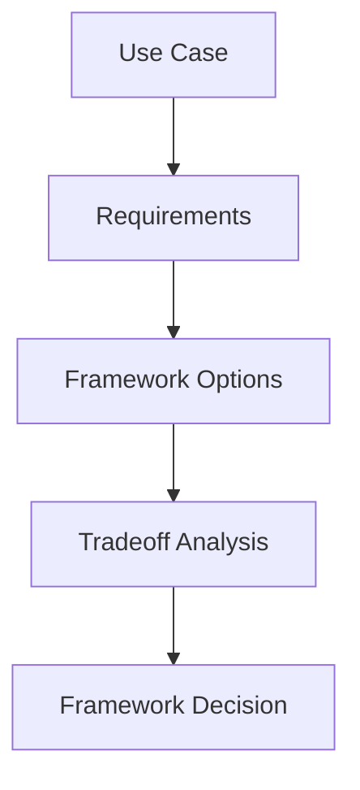

# Module 12 — Agent Frameworks Comparison

[English](12-agent-frameworks-comparison.md)

## 目標

學習如何比較 Agent Framework，並為專案選擇合適工具。

沒有任何 framework 適合所有情境。正確選擇取決於 workflow 複雜度、tool integration、memory 需求、multi-agent 設計與 production requirements。

---

## 心智模型

```text
Use case → Requirements → Framework strengths → Tradeoffs → Decision
```

---

## 比較維度

### Abstraction Level

Framework 隱藏或暴露 agent loop 的程度。

### Workflow Control

Framework 對 state machine、routing、retries 與 human approval 的支援程度。

### Tool Integration

工具與 MCP servers 連接是否容易。

### Memory Support

Memory 是否容易加入、檢索、稽核與共享。

### Multi-Agent Support

Framework 如何處理 supervisor、specialists、debate、reflection 與 handoff。

### Production Readiness

Framework 對 tracing、evaluation、deployment 與 error handling 的支援程度。

---

## Framework 類型

| 類型 | 適合場景 |
|---|---|
| Lightweight SDKs | 簡單 Agent 與直接模型控制 |
| Workflow frameworks | State machines 與 production workflows |
| Multi-agent frameworks | 角色分工協作與 agent teams |
| RAG frameworks | 知識檢索與文件流程 |
| Observability tools | Tracing、evaluation 與 monitoring |

---

## 架構圖



---

## Hands-on Exercise

為一個專案比較 frameworks：

```text
Project goal:
Workflow complexity:
Tool requirements:
Memory requirements:
Multi-agent requirements:
Production requirements:
Recommended framework:
Reasoning:
```

---

## Checklist

如果你能做到以下事項，就代表理解本模組：

- 依照 system requirements 比較 frameworks
- 避免因為流行而選工具
- 解釋 tradeoffs
- 根據 project stage 匹配 framework
- 設計 framework-agnostic architecture

---

## 常見錯誤

- 還沒定義需求就選 framework
- 用複雜 framework 解簡單問題
- 忽略 production needs
- 將 business logic 過度綁死在單一 framework
- 把 demo 誤認成可維護系統

---

## Deep Dive：Framework 不是答案，Framework 是放大器

最後一章我們談 framework。很多人學 Agent 會先問：「我該用 LangGraph、CrewAI、AutoGen、OpenAI Agents SDK，還是自己寫？」這個問題很合理，但順序常常反了。

你還沒定義 task、tools、memory、workflow、eval，就先選 framework，這就像還不知道要蓋公寓還是倉庫，就先買了一台很貴的起重機。

Framework 會放大你的設計。如果你的邊界清楚，它幫你管理複雜度。如果你的邊界不清楚，它會把混亂包裝得很漂亮。你沒有看錯，漂亮的混亂還是混亂。

### Black-box View

```text
Input: project requirements, complexity, team constraints
Output: framework choice and architecture decision
Objective: choose the simplest tool that supports the required control surface
```

### Naive Failure

```text
Naive design:
Choose the most popular framework first.

Failure:
- simple task becomes over-engineered
- business logic tightly coupled to framework
- eval and safety are postponed
- migration becomes hard
```

### Decision Process

先回答這些問題：

1. 你的 workflow 是 linear 還是 graph？
2. 你需要 tool calling 還是只是 structured output？
3. 你需要 long-term memory 嗎？
4. 你需要 multi-agent 嗎，還是 single workflow 就夠？
5. 你需要 production tracing、eval、deployment support 嗎？
6. 團隊熟悉哪個 stack？

### Decision Table

| Need | Good Fit |
|---|---|
| Minimal teaching example | Plain Python |
| Graph workflow and controllable state | LangGraph-style architecture |
| Agent SDK and tool integration | OpenAI Agents SDK-style architecture |
| Multi-agent conversation experiments | AutoGen/CrewAI-style architecture |
| RAG-heavy app | LlamaIndex/LangChain-style retrieval stack |
| Production monitoring | Add observability regardless of framework |

### Architecture Rule

把 business logic 放在 framework 外面：

```text
agent spec
tool policy
memory policy
eval cases
safety gate
```

這些東西應該可以在換 framework 時保留下來。否則你學到的是 framework API，不是 Agent Engineering。

### Capstone Checkpoint

```bash
python capstone-starter/run_demo.py
python capstone-starter/run_eval.py
```

先用 plain Python starter 確認 architecture，再決定要不要換 framework。

### Evaluation Cases

| Case | Expected Decision |
|---|---|
| one-step summarizer | plain Python |
| branching approval workflow | graph framework or explicit state machine |
| many specialists with handoff | multi-agent framework may help |
| strict production safety | framework plus external eval/safety layer |
| early prototype | avoid heavy abstraction until behavior is clear |

### 常見誤解修正

誤解：用了某個 framework 就 production-ready。

修正：Framework 不會自動給你好的 eval、policy、memory boundary、approval design。那些還是你要設計。

---

## Outcome

完成本模組後，你應該能根據工程需求，而不是流行程度選擇 Agent Framework。

你已完成 Agent Engineering Curriculum。
