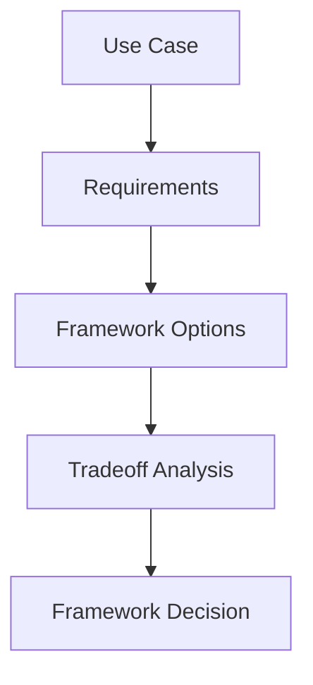

# Module 12 — Agent Frameworks Comparison

[English](12-agent-frameworks-comparison.md)

## 目標

學習如何比較 Agent Framework，並為專案選擇合適工具。

沒有任何 framework 適合所有情境。正確選擇取決於 workflow 複雜度、tool integration、memory 需求、multi-agent 設計與 production requirements。

---

## 心智模型

```text
Use case → Requirements → Framework strengths → Tradeoffs → Decision
```

---

## 比較維度

### Abstraction Level

Framework 隱藏或暴露 agent loop 的程度。

### Workflow Control

Framework 對 state machine、routing、retries 與 human approval 的支援程度。

### Tool Integration

工具與 MCP servers 連接是否容易。

### Memory Support

Memory 是否容易加入、檢索、稽核與共享。

### Multi-Agent Support

Framework 如何處理 supervisor、specialists、debate、reflection 與 handoff。

### Production Readiness

Framework 對 tracing、evaluation、deployment 與 error handling 的支援程度。

---

## Framework 類型

| 類型 | 適合場景 |
|---|---|
| Lightweight SDKs | 簡單 Agent 與直接模型控制 |
| Workflow frameworks | State machines 與 production workflows |
| Multi-agent frameworks | 角色分工協作與 agent teams |
| RAG frameworks | 知識檢索與文件流程 |
| Observability tools | Tracing、evaluation 與 monitoring |

---

## 架構圖



---

## Hands-on Exercise

為一個專案比較 frameworks：

```text
Project goal:
Workflow complexity:
Tool requirements:
Memory requirements:
Multi-agent requirements:
Production requirements:
Recommended framework:
Reasoning:
```

---

## Checklist

如果你能做到以下事項，就代表理解本模組：

- 依照 system requirements 比較 frameworks
- 避免因為流行而選工具
- 解釋 tradeoffs
- 根據 project stage 匹配 framework
- 設計 framework-agnostic architecture

---

## 常見錯誤

- 還沒定義需求就選 framework
- 用複雜 framework 解簡單問題
- 忽略 production needs
- 將 business logic 過度綁死在單一 framework
- 把 demo 誤認成可維護系統

---

## Outcome

完成本模組後，你應該能根據工程需求，而不是流行程度選擇 Agent Framework。

你已完成 Agent Engineering Curriculum。
