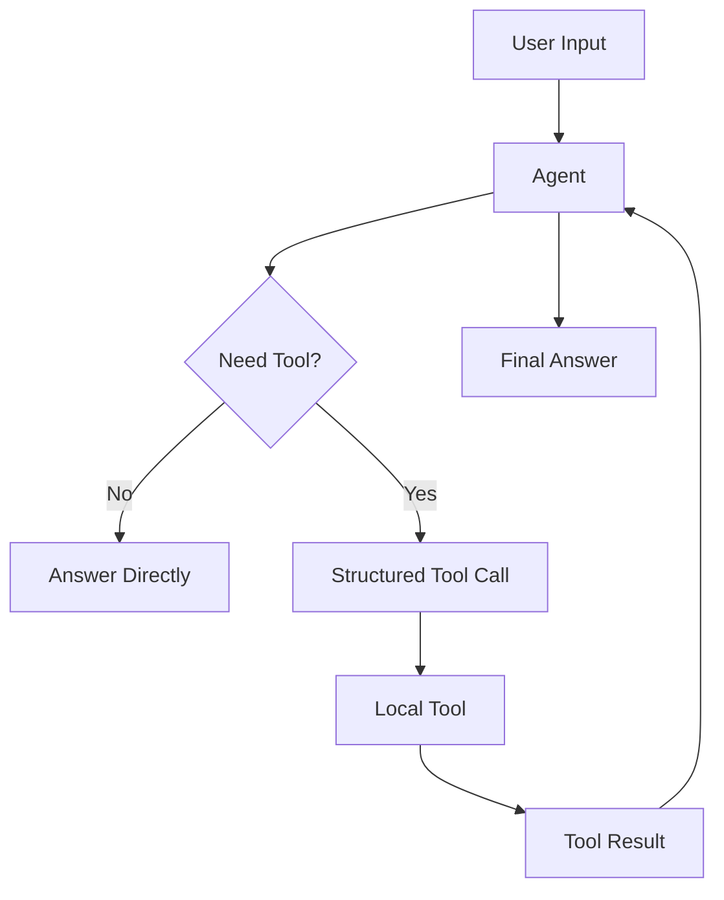

# Example 02 — Tool-Using Agent

[繁體中文](README_zh.md)

This example demonstrates how to build an agent that can call external tools.

The goal is to move from a text-only agent to an agent that can decide when to use tools, call them with structured arguments, and use the results to produce a final answer.

---

## What this example builds

A **Tool-Using Assistant** with three local tools:

- `calculator` — evaluates safe arithmetic expressions
- `word_count` — counts words and characters in text
- `todo_builder` — turns messy notes into a structured todo list

---

## Folder structure

```text
02-tool-using-agent/
├── README.md
├── README_zh.md
├── main.py
├── tools.py
├── agent_config.json
├── requirements.txt
└── .env.example
```

---

## Quick start

Run the local learning demo first. It works without an API key and calls the local tools directly:

```bash
cd examples/02-tool-using-agent
python main.py
```

To call a real OpenAI model, install the optional dependency and add your API key to `.env`:

```bash
python -m venv .venv
source .venv/bin/activate
pip install -r requirements.txt
cp .env.example .env
python main.py
```

---

## Agent design

| Field | Description |
|---|---|
| Agent name | Tool-Using Assistant |
| Purpose | Decide when to use tools and explain the result clearly |
| Input | User question or task |
| Output | Final answer with tool-grounded result |
| Allowed actions | Call approved local tools |
| Not allowed | Invent tool results, call unknown tools, execute unsafe code |

---

## Tool calling flow



---

## Learning objectives

After completing this example, you should understand:

- how to define tool schemas
- how to expose tools to an agent
- how to execute local tools safely
- how to validate tool names and arguments
- how to return tool observations back to the model
- how tool use differs from normal text generation

---

## Example prompts

```text
What is (128 * 42) / 7?
```

```text
Count the words in this sentence: Agent engineering requires tools, memory, and workflow control.
```

```text
Turn this into a todo list: finish README, test the tool agent, prepare the next MCP example.
```

---

## Next step

After this example, continue to:

```text
examples/03-mcp-agent
```

where the agent will learn to connect to MCP-style tools.
