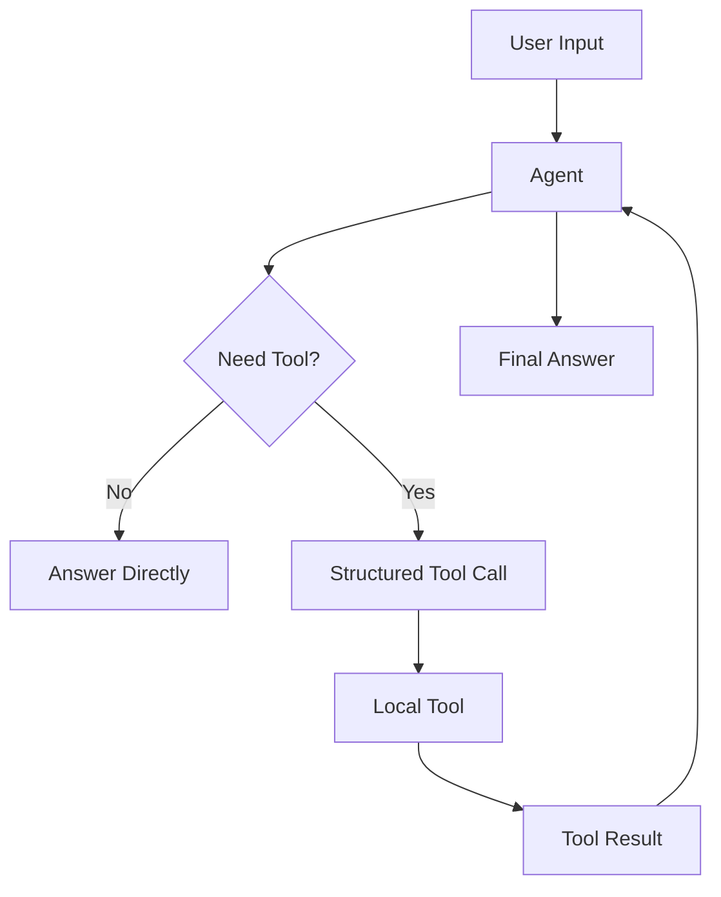

# Example 02 — Tool-Using Agent

[English](README.md)

這個範例示範如何建立一個可以呼叫外部工具的 Agent。

目標是讓 Agent 從只能產生文字，進化成能判斷何時需要工具、用結構化參數呼叫工具，並根據工具結果產生最終回答。

---

## 這個範例會建立什麼？

一個 **Tool-Using Assistant**，內建三個本地工具：

- `calculator` — 計算安全的數學表達式
- `word_count` — 統計文字中的字數與字元數
- `todo_builder` — 將雜亂筆記轉成結構化 todo list

---

## 資料夾結構

```text
02-tool-using-agent/
├── README.md
├── README_zh.md
├── main.py
├── tools.py
├── agent_config.json
├── requirements.txt
└── .env.example
```

---

## 快速開始

先跑本地教學版。這個版本不需要 API key，會直接呼叫 local tools，讓你先看懂 tool use flow：

```bash
cd examples/02-tool-using-agent
python main.py
```

如果你要呼叫真正的 OpenAI model，再安裝 optional dependency，並在 `.env` 裡加入你的 API key：

```bash
python -m venv .venv
source .venv/bin/activate
pip install -r requirements.txt
cp .env.example .env
python main.py
```

---

## Agent 設計

| 欄位 | 說明 |
|---|---|
| Agent name | Tool-Using Assistant |
| Purpose | 判斷何時使用工具，並清楚解釋工具結果 |
| Input | 使用者問題或任務 |
| Output | 根據工具結果產生的最終回答 |
| Allowed actions | 呼叫已允許的本地工具 |
| Not allowed | 編造工具結果、呼叫未知工具、執行不安全程式碼 |

---

## Tool Calling Flow



---

## 學習目標

完成這個範例後，你應該能理解：

- 如何定義 tool schemas
- 如何將 tools 暴露給 Agent
- 如何安全執行本地工具
- 如何驗證 tool names 與 arguments
- 如何將 tool observations 回傳給模型
- tool use 與一般文字生成的差異

---

## 範例 prompts

```text
What is (128 * 42) / 7?
```

```text
Count the words in this sentence: Agent engineering requires tools, memory, and workflow control.
```

```text
Turn this into a todo list: finish README, test the tool agent, prepare the next MCP example.
```

---

## 下一步

完成這個範例後，可以繼續：

```text
examples/03-mcp-agent
```

下一個範例會讓 Agent 學會連接 MCP-style tools。
