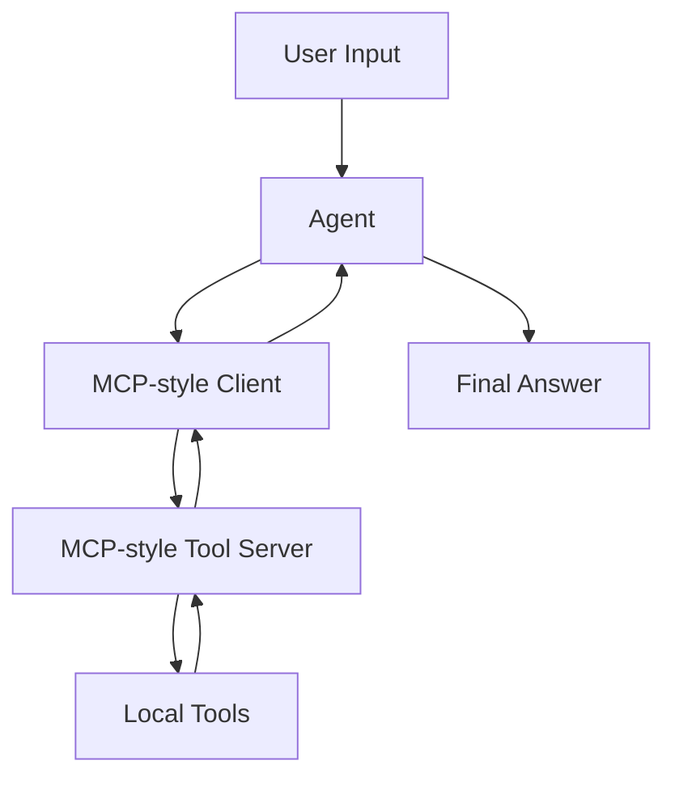

# Example 03 — MCP Agent

[繁體中文](README_zh.md)

This example demonstrates how to connect an agent to tools through an MCP-style interface.

The goal is to understand the architecture before adding a full MCP SDK dependency.

---

## What this example builds

A **MCP-style Agent** that communicates with a local tool server abstraction.

The tool server exposes:

- `list_tools()` — returns available tools and schemas
- `call_tool()` — executes a named tool with structured arguments

---

## Why MCP-style first?

MCP-style architecture introduces a clean separation between the agent and external capabilities.

Instead of hard-coding tools directly inside the agent, we place tools behind a server-like boundary:

```text
Agent → MCP Client → Tool Server → Tool Result
```

This makes tools easier to replace, audit, reuse, and secure.

The key engineering idea is not the protocol name itself. The key idea is the boundary:

```text
The agent reasons.
The client translates.
The server owns tools.
The tool returns observations.
```

---

## Direct tools vs MCP-style tools

| Design | Description | Tradeoff |
|---|---|---|
| Direct tool import | Agent code imports and calls tool functions directly | Simple, but hard to reuse across agents |
| Tool registry | Agent runtime calls tools from a local registry | Better organization, still coupled to the app |
| MCP-style boundary | Agent uses a client to call tools owned by a server | More modular, easier to audit and replace |

---

## Folder structure

```text
03-mcp-agent/
├── README.md
├── README_zh.md
├── main.py
├── mcp_client.py
├── mcp_server.py
├── tools.py
├── agent_config.yaml
├── requirements.txt
└── .env.example
```

---

## Quick start

```bash
cd examples/03-mcp-agent
python -m venv .venv
source .venv/bin/activate
pip install -r requirements.txt
cp .env.example .env
python main.py
```

Add your API key to `.env` before running.

---

## Architecture



---

## Implementation walkthrough

### `tools.py`

Contains the actual tool implementations.

In this example, tools are intentionally simple:

- local knowledge search
- demo user profile lookup
- explanation of the server boundary

### `mcp_server.py`

Owns the tool registry and exposes two server-like methods:

```python
list_tools()
call_tool(name, arguments)
```

The agent does not import tool functions directly.

### `mcp_client.py`

Acts as the boundary between the agent runtime and the server.

In a real MCP implementation, this layer would communicate with an external MCP server.

### `main.py`

Runs the agent loop:

```text
Load server tools
Send tool schemas to model
Receive tool call
Call tool through client
Return observation to model
Generate final answer
```

---

## Safety notes

MCP-style systems make integration easier, but they also increase the importance of tool security.

For real systems, consider:

- tool permission boundaries
- input validation
- command allowlists
- audit logs
- human approval for risky actions
- protection against prompt injection
- least-privilege server design

---

## Learning objectives

After completing this example, you should understand:

- why MCP separates agents from tools
- how to list available tools from a server
- how to call tools through a client boundary
- how MCP-style design differs from direct tool imports
- how this pattern prepares for real MCP servers
- why MCP-style integration needs security controls

---

## Example prompts

```text
Search the local knowledge base for memory policy.
```

```text
Get the profile for user_001 and summarize the care context.
```

```text
Use available tools to explain what MCP-style separation means.
```

---

## References

- Anthropic, Model Context Protocol public documentation and ecosystem materials.
- Yao et al. (2022), ReAct: Synergizing Reasoning and Acting in Language Models.
- Public MCP security reports and discussions on tool permission risks.

---

## Next step

After this example, continue to:

```text
examples/04-memory-agent
```

where the agent will learn to store and retrieve memory.
