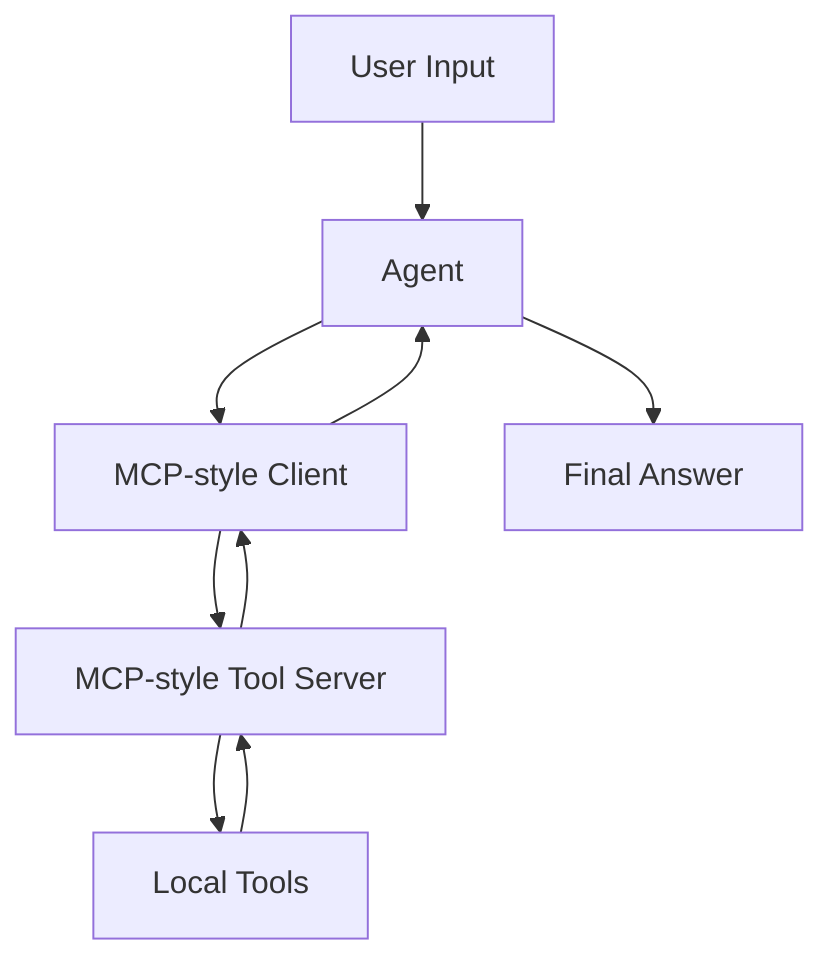

# Example 03 — MCP Agent

[繁體中文](README_zh.md)

This example demonstrates how to connect an agent to tools through an MCP-style interface.

The goal is to understand the architecture before adding a full MCP SDK dependency.

---

## What this example builds

A **MCP-style Agent** that communicates with a local tool server abstraction.

The tool server exposes:

- `list_tools()` — returns available tools and schemas
- `call_tool()` — executes a named tool with structured arguments

---

## Why MCP-style first?

MCP introduces a clean separation between the agent and external capabilities.

Instead of hard-coding tools directly inside the agent, we place tools behind a server-like boundary:

```text
Agent → MCP Client → Tool Server → Tool Result
```

This makes tools easier to replace, audit, and reuse.

---

## Folder structure

```text
03-mcp-agent/
├── README.md
├── README_zh.md
├── main.py
├── mcp_client.py
├── mcp_server.py
├── tools.py
├── agent_config.yaml
├── requirements.txt
└── .env.example
```

---

## Quick start

```bash
cd examples/03-mcp-agent
python -m venv .venv
source .venv/bin/activate
pip install -r requirements.txt
cp .env.example .env
python main.py
```

Add your API key to `.env` before running.

---

## Architecture



---

## Learning objectives

After completing this example, you should understand:

- why MCP separates agents from tools
- how to list available tools from a server
- how to call tools through a client boundary
- how MCP-style design differs from direct tool imports
- how this pattern prepares for real MCP servers

---

## Example prompts

```text
Search the local knowledge base for memory policy.
```

```text
Get the profile for user_001 and summarize the care context.
```

```text
Use available tools to explain what MCP-style separation means.
```

---

## Next step

After this example, continue to:

```text
examples/04-memory-agent
```

where the agent will learn to store and retrieve memory.
