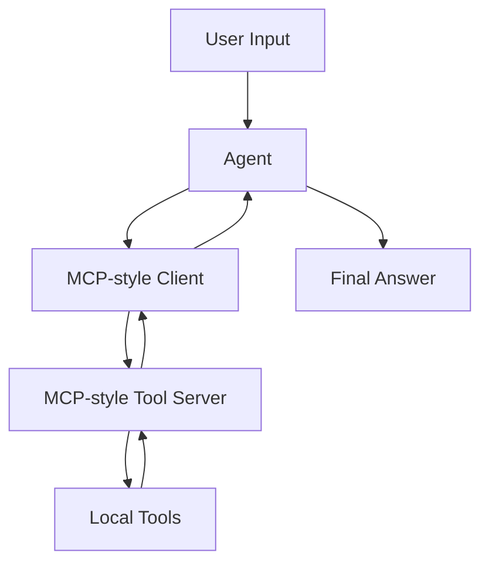

# Example 03 — MCP Agent

[English](README.md)

這個範例示範如何透過 MCP-style interface 將 Agent 連接到工具。

目標是先理解 MCP 的架構概念，再引入完整 MCP SDK。

---

## 這個範例會建立什麼？

一個 **MCP-style Agent**，會和本地 tool server abstraction 溝通。

Tool server 提供：

- `list_tools()` — 回傳可用工具與 schemas
- `call_tool()` — 使用結構化參數執行指定工具

---

## 為什麼先做 MCP-style？

MCP 的核心價值是把 Agent 與外部能力清楚分離。

不是把 tools 直接 hard-code 在 Agent 裡，而是把工具放在類似 server 的邊界後面：

```text
Agent → MCP Client → Tool Server → Tool Result
```

這會讓工具更容易替換、稽核與重用。

---

## 資料夾結構

```text
03-mcp-agent/
├── README.md
├── README_zh.md
├── main.py
├── mcp_client.py
├── mcp_server.py
├── tools.py
├── agent_config.json
├── requirements.txt
└── .env.example
```

---

## 快速開始

先跑本地教學版。這個版本不需要 API key，會直接演示 MCP-style client/server boundary：

```bash
cd examples/03-mcp-agent
python main.py
```

如果你要呼叫真正的 OpenAI model，再安裝 optional dependency，並在 `.env` 裡加入你的 API key：

```bash
python -m venv .venv
source .venv/bin/activate
pip install -r requirements.txt
cp .env.example .env
python main.py
```

---

## 架構圖



---

## 學習目標

完成這個範例後，你應該能理解：

- 為什麼 MCP 要把 Agent 與 tools 分離
- 如何從 server 列出可用 tools
- 如何透過 client boundary 呼叫工具
- MCP-style design 與 direct tool imports 的差異
- 這個 pattern 如何準備銜接真正的 MCP servers

---

## 範例 prompts

```text
Search the local knowledge base for memory policy.
```

```text
Get the profile for user_001 and summarize the care context.
```

```text
Use available tools to explain what MCP-style separation means.
```

---

## 下一步

完成這個範例後，可以繼續：

```text
examples/04-memory-agent
```

下一個範例會讓 Agent 學會儲存與檢索 memory。
